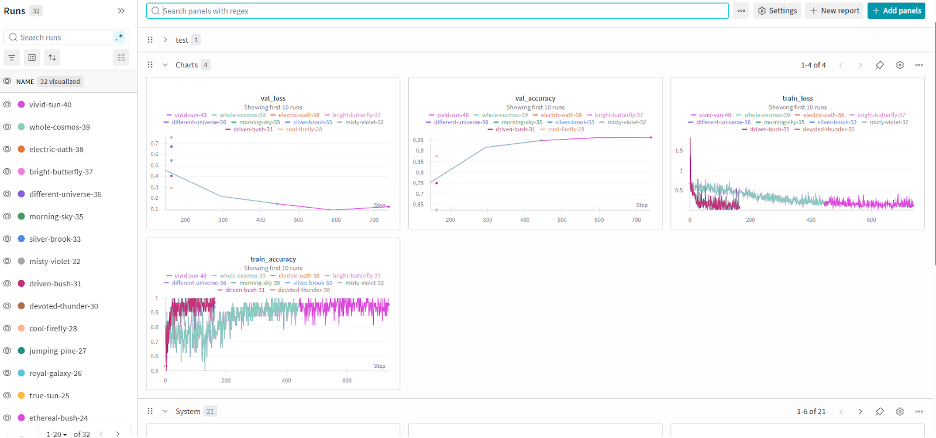
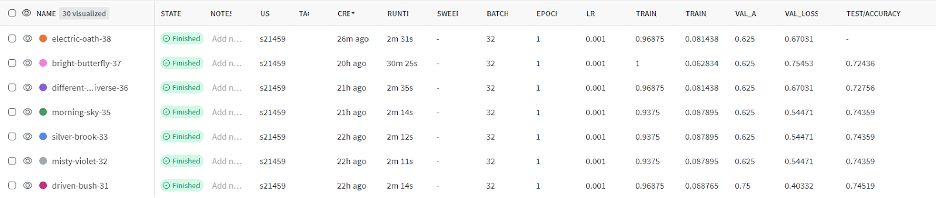
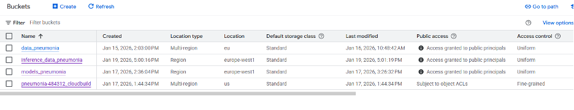
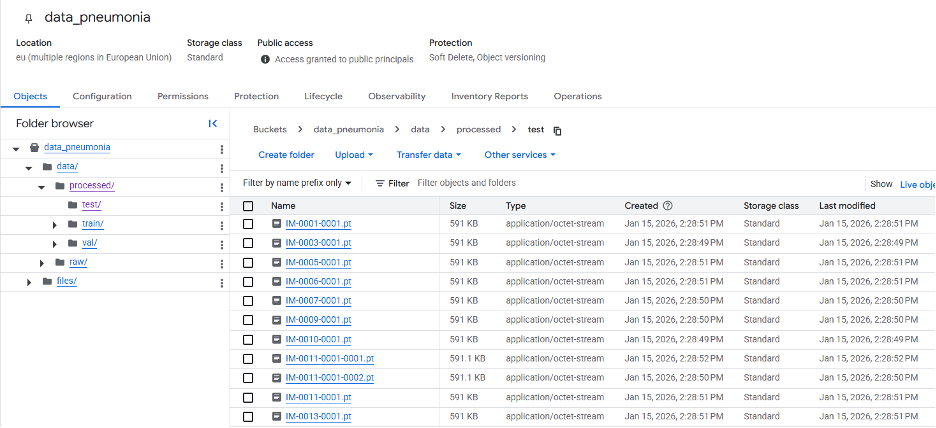
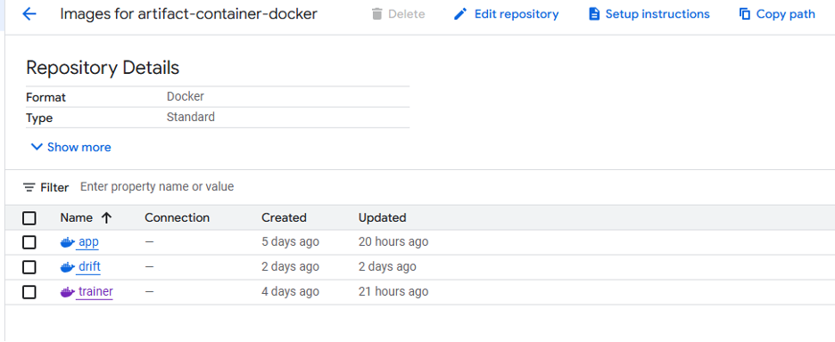
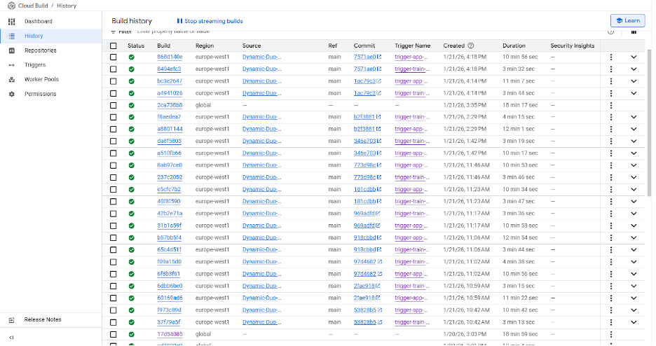
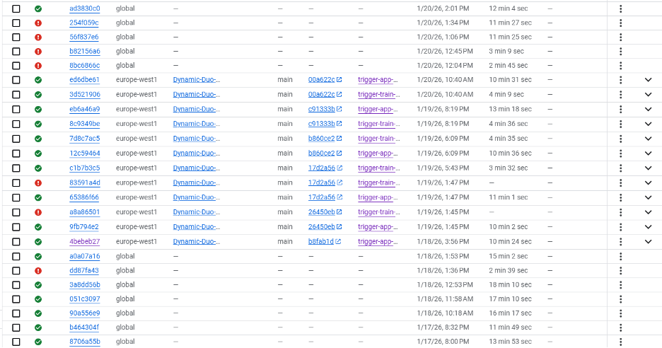

# Exam template for 02476 Machine Learning Operations

This is the report template for the exam. Please only remove the text formatted as with three dashes in front and behind
like:

```--- question 1 fill here ---```

Where you instead should add your answers. Any other changes may have unwanted consequences when your report is
auto-generated at the end of the course. For questions where you are asked to include images, start by adding the image
to the `figures` subfolder (please only use `.png`, `.jpg` or `.jpeg`) and then add the following code in your answer:

``

In addition to this markdown file, we also provide the `report.py` script that provides two utility functions:

Running:

```bash
python report.py html
```

Will generate a `.html` page of your report. After the deadline for answering this template, we will auto-scrape
everything in this `reports` folder and then use this utility to generate a `.html` page that will be your serve
as your final hand-in.

Running

```bash
python report.py check
```

Will check your answers in this template against the constraints listed for each question e.g. is your answer too
short, too long, or have you included an image when asked. For both functions to work you mustn't rename anything.
The script has two dependencies that can be installed with

```bash
pip install typer markdown
```

or

```bash
uv add typer markdown
```

## Overall project checklist

The checklist is *exhaustive* which means that it includes everything that you could do on the project included in the
curriculum in this course. Therefore, we do not expect at all that you have checked all boxes at the end of the project.
The parenthesis at the end indicates what module the bullet point is related to. Please be honest in your answers, we
will check the repositories and the code to verify your answers.

### Week 1

* [X] Create a git repository (M5)
* [X] Make sure that all team members have write access to the GitHub repository (M5)
* [X] Create a dedicated environment for you project to keep track of your packages (M2)
* [X] Create the initial file structure using cookiecutter with an appropriate template (M6)
* [X] Fill out the `data.py` file such that it downloads whatever data you need and preprocesses it (if necessary) (M6)
* [X] Add a model to `model.py` and a training procedure to `train.py` and get that running (M6)
* [X] Remember to either fill out the `requirements.txt`/`requirements_dev.txt` files or keeping your
    `pyproject.toml`/`uv.lock` up-to-date with whatever dependencies that you are using (M2+M6)
* [X] Remember to comply with good coding practices (`pep8`) while doing the project (M7)
* [X] Do a bit of code typing and remember to document essential parts of your code (M7)
* [X] Setup version control for your data or part of your data (M8)
* [X] Add command line interfaces and project commands to your code where it makes sense (M9)
* [X] Construct one or multiple docker files for your code (M10)
* [X] Build the docker files locally and make sure they work as intended (M10)
* [X] Write one or multiple configurations files for your experiments (M11)
* [X] Used Hydra to load the configurations and manage your hyperparameters (M11)
* [ ] Use profiling to optimize your code (M12)
* [X] Use logging to log important events in your code (M14)
* [X] Use Weights & Biases to log training progress and other important metrics/artifacts in your code (M14)
* [ ] Consider running a hyperparameter optimization sweep (M14)
* [ ] Use PyTorch-lightning (if applicable) to reduce the amount of boilerplate in your code (M15)

### Week 2

* [X] Write unit tests related to the data part of your code (M16)
* [X] Write unit tests related to model construction and or model training (M16)
* [X] Calculate the code coverage (M16)
* [X] Get some continuous integration running on the GitHub repository (M17)
* [X] Add caching and multi-os/python/pytorch testing to your continuous integration (M17)
* [X] Add a linting step to your continuous integration (M17)
* [ ] Add pre-commit hooks to your version control setup (M18)
* [ ] Add a continues workflow that triggers when data changes (M19)
* [ ] Add a continues workflow that triggers when changes to the model registry is made (M19)
* [X] Create a data storage in GCP Bucket for your data and link this with your data version control setup (M21)
* [X] Create a trigger workflow for automatically building your docker images (M21)
* [X] Get your model training in GCP using either the Engine or Vertex AI (M21)
* [X] Create a FastAPI application that can do inference using your model (M22)
* [X] Deploy your model in GCP using either Functions or Run as the backend (M23)
* [X] Write API tests for your application and setup continues integration for these (M24)
* [X] Load test your application (M24)
* [ ] Create a more specialized ML-deployment API using either ONNX or BentoML, or both (M25)
* [ ] Create a frontend for your API (M26)

### Week 3

* [X] Check how robust your model is towards data drifting (M27)
* [X] Setup collection of input-output data from your deployed application (M27)
* [X] Deploy to the cloud a drift detection API (M27)
* [ ] Instrument your API with a couple of system metrics (M28)
* [ ] Setup cloud monitoring of your instrumented application (M28)
* [ ] Create one or more alert systems in GCP to alert you if your app is not behaving correctly (M28)
* [X] If applicable, optimize the performance of your data loading using distributed data loading (M29)
* [ ] If applicable, optimize the performance of your training pipeline by using distributed training (M30)
* [ ] Play around with quantization, compilation and pruning for you trained models to increase inference speed (M31)

### Extra

* [ ] Write some documentation for your application (M32)
* [ ] Publish the documentation to GitHub Pages (M32)
* [ ] Revisit your initial project description. Did the project turn out as you wanted?
* [ ] Create an architectural diagram over your MLOps pipeline
* [ ] Make sure all group members have an understanding about all parts of the project
* [ ] Uploaded all your code to GitHub

## Group information

### Question 1
> **Enter the group number you signed up on <learn.inside.dtu.dk>**
>
> Answer:

17

### Question 2
> **Enter the study number for each member in the group**
>
> Example:
>
> *sXXXXXX, sXXXXXX, sXXXXXX*
>
> Answer:

s194688, s214598

### Question 3
> **Did you end up using any open-source frameworks/packages not covered in the course during your project? If so**
> **which did you use and how did they help you complete the project?**
>
> Recommended answer length: 0-200 words.
>
> Example:
> *We used the third-party framework ... in our project. We used functionality ... and functionality ... from the*
> *package to do ... and ... in our project*.
>
> Answer:

No, we only used frameworks/packages covered in the course.

## Coding environment

> In the following section we are interested in learning more about you local development environment. This includes
> how you managed dependencies, the structure of your code and how you managed code quality.

### Question 4

> **Explain how you managed dependencies in your project? Explain the process a new team member would have to go**
> **through to get an exact copy of your environment.**
>
> Recommended answer length: 100-200 words
>
> Example:
> *We used ... for managing our dependencies. The list of dependencies was auto-generated using ... . To get a*
> *complete copy of our development environment, one would have to run the following commands*
>
> Answer:

For managing our local environment, we used the UV package manager. Dependency management was handled with the pyproject.toml file, which contains all our intended dependencies together with some additional metadata. To add a dependency to our project, the command "uv add package" was used, which installed the specified package and added it to the pyproject.toml and uv.lock. We also did "uv add package==x.y.z" to install a specific version of a package. A dependency could also be manually added by typing in the name of a new package in the pyproject.toml file with some version dependency, followed by running the command "uv sync", which then installs the newly added package. A new team member who has installed UV can get a complete copy of our environment by running the command "uv sync" after cloning the repository with the root of the repository as the working directory. This will create a virtual environment with the package versions defined in the uv.lock file.

### Question 5

> **We expect that you initialized your project using the cookiecutter template. Explain the overall structure of your**
> **code. What did you fill out? Did you deviate from the template in some way?**
>
> Recommended answer length: 100-200 words
>
> Example:
> *From the cookiecutter template we have filled out the ... , ... and ... folder. We have removed the ... folder*
> *because we did not use any ... in our project. We have added an ... folder that contains ... for running our*
> *experiments.*
>
> Answer:

We initialised our project with the provided "mlops_template" using cookiecutter and chose the "advanced" project structure. This template uses a structure designed to support MLOps and helps to ensure that contributors and others can find the code that they are looking for. For example, the code for the model is located in a specific place. The main code is located in src/, containing scripts for model definition, data handling, training and evaluation procedures, visualisation methods and the api. Separate folders for documentation, testing, reporting, Docker and configuration are kept at the root level.

We added a few files to the src to get some functionalities for datadrift and another API file, as we wanted to ensure we were able to do the datadrift report both locally and in the cloud. 

### Question 6

> **Did you implement any rules for code quality and format? What about typing and documentation? Additionally,**
> **explain with your own words why these concepts matters in larger projects.**
>
> Recommended answer length: 100-200 words.
>
> Example:
> *We used ... for linting and ... for formatting. We also used ... for typing and ... for documentation. These*
> *concepts are important in larger projects because ... . For example, typing ...*
>
> Answer:

We used Ruff for linting and formatting. Here we specified line length of 120 to ensure that the lines did not continue out of the screen. "E" was used as a styling rule, solving white space issues and indentation problems. "F" checked that we used the imports and did not have variables that were assigned but never used. "I" ensured a sorted and well-organised import order. In each function, we expressively stated what Type is expected and what Type is returned. Furthermore, we provided a high-level description of the functions with a detailed listing of returns and Args. 

This matters a lot as it makes the code more readable for ourselves and others. It also becomes easier to maintain. These practices make it easy for other developers to understand, use and further develop on the codebase, overall reducing errors.


## Version control

> In the following section we are interested in how version control was used in your project during development to
> corporate and increase the quality of your code.

### Question 7

> **How many tests did you implement and what are they testing in your code?**
>
> Recommended answer length: 50-100 words.
>
> Example:
> *In total we have implemented X tests. Primarily we are testing ... and ... as these the most critical parts of our*
> *application but also ... .*
>
> Answer:

In total, we implemented 6 tests. One extensive test for checking the data using a dummy dataset to ensure that it behaved as expected, everything from the initialisation to the normalisation and storing of data. Two tests for the model: one checking the initialisation and another the forward pass. Lastly, three tests for our API to check whether the functions worked as intended. We also implemented a load test for the API. 

### Question 8

> **What is the total code coverage (in percentage) of your code? If your code had a code coverage of 100% (or close**
> **to), would you still trust it to be error free? Explain you reasoning.**
>
> Recommended answer length: 100-200 words.
>
> Example:
> *The total code coverage of code is X%, which includes all our source code. We are far from 100% coverage of our **
> *code and even if we were then...*
>
> Answer:

The total code coverage of the code is X%. We are not close to achieving 100%, but it is also reflected by the fact that we do have two very similar API scripts where only one is tested. Furthermore, we focused on testing the model rather than training and evaluation, which are longer snippets of code. 
Even if our code had a code coverage of nearly 100%, we would not expect the code to be error-free. 100% code coverage means that every single line of code gets executed when running all tests. This does not guarantee that the outputs are correct or meaningful. Additionally, we test our components separately with the use of unit tests and errors might occur during interactions between these components when running the full model. Lastly, one could have potential mathematical problems in loss functions, which might not be checked in a unit test.

### Question 9

> **Did you workflow include using branches and pull requests? If yes, explain how. If not, explain how branches and**
> **pull request can help improve version control.**
>
> Recommended answer length: 100-200 words.
>
> Example:
> *We made use of both branches and PRs in our project. In our group, each member had an branch that they worked on in*
> *addition to the main branch. To merge code we ...*
>
> Answer:

When we developed a new feature for our project and wanted to push code to our GitHub repository, we pushed to a separate feature branch. When this feature was complete, and no conflicts occurred in GitHub, we merged the feature branch into the main branch, followed by deleting the feature branch. This workflow fits well for us, as separate people could continue the development of a feature. We did not make use of pull requests except for the dependaBot. However, pull requests can improve version control by allowing team members to comment on the code before it is merged into the main branch. In this way, pull requests can help reduce the risk of introducing errors into the main branch. By doing pull request contributors can also comment on the overall code readability, ensuring that the code is clear before merging into main.

### Question 10

> **Did you use DVC for managing data in your project? If yes, then how did it improve your project to have version**
> **control of your data. If no, explain a case where it would be beneficial to have version control of your data.**
>
> Recommended answer length: 100-200 words.
>
> Example:
> *We did make use of DVC in the following way: ... . In the end it helped us in ... for controlling ... part of our*
> *pipeline*
>
> Answer:

We used DVC for managing data in our project in combination with a cloud storage bucket. It allowed us to update the dataset and still have easy access to earlier versions of the data, similar to GitHub. In our project, we extended the validation set so DVC allowed for easy update of our storage bucket, so the other group member could pull the update of the dataset without running a script. 

Furthermore, it was also beneficial for the Docker images we built in the cloud. Since the dataset itself was not stored in the GitHub repository, we could use dvc pull when running a Docker image to retrieve the correct version of the data. This was important when we set up triggers for automatic creation of Docker images using Cloud Build, as it did not have access to the local data storage. 

### Question 11

> **Discuss you continuous integration setup. What kind of continuous integration are you running (unittesting,**
> **linting, etc.)? Do you test multiple operating systems, Python  version etc. Do you make use of caching? Feel free**
> **to insert a link to one of your GitHub actions workflow.**
>
> Recommended answer length: 200-300 words.
>
> Example:
> *We have organized our continuous integration into 3 separate files: one for doing ..., one for running ... testing*
> *and one for running ... . In particular for our ..., we used ... .An example of a triggered workflow can be seen*
> *here: <weblink>*
>
> Answer:

We used 4 separate files for setting up continuous integration in our repository. One file was used to do linting on our code. Here, it would use the ruff check and format to investigate our formatting and code quality, ensuring that these qualities were met in every file. We also have a file that runs all of our unit tests, which checks if we have broken working components with the newest push, which helps us quickly identify bugs. Lastly, we have two files that are triggered from the cloud that built two separate Docker images for our Artifact Registry in the cloud. One builds an image that can do training/evaluating, and another creates a new version of our inference app Docker image. 

We do tests for multiple operating systems, namely "ubuntu-latest", "windows-latest", "macos-latest", and for Python versions 3.11 and 3.12. This is important as we want the results to be reproducible on any device and ensure that the code behaves consistently regardless of operating system or Python version.

We do use Caching, which stores the uv package download directory between the continuous integration runs. This avoids redownloading of dependencies on every execution, which results in significantly faster testing of the code after the code is pushed to main.

Here is a link to a GitHub action workflow:
https://github.com/Dynamic-Duo-AT/pneumonia_classification/actions/workflows/tests.yaml

## Running code and tracking experiments

> In the following section we are interested in learning more about the experimental setup for running your code and
> especially the reproducibility of your experiments.

### Question 12

> **How did you configure experiments? Did you make use of config files? Explain with coding examples of how you would**
> **run a experiment.**
>
> Recommended answer length: 50-100 words.
>
> Example:
> *We used a simple argparser, that worked in the following way: Python  my_script.py --lr 1e-3 --batch_size 25*
>
> Answer:

To run experiments, we used .yaml configuration files in combination with Hydra. This gave us an overview of experiments, as it enabled us to keep all variable values separate from the code. Furthermore, the configuration files also help with reproducibility.
To run an experiment, we either used one of the specified invoke tasks or used the following command: uv run python src/pneumonia/train.py --config-name exp1_workers

### Question 13

> **Reproducibility of experiments are important. Related to the last question, how did you secure that no information**
> **is lost when running experiments and that your experiments are reproducible?**
>
> Recommended answer length: 100-200 words.
>
> Example:
> *We made use of config files. Whenever an experiment is run the following happens: ... . To reproduce an experiment*
> *one would have to do ...*
>
> Answer:

As mentioned, to configure experiments, we used YAML configuration files in combination with Hydra to store our experiment data configuration, such as learning rate, batch size, epochs, model type, etc. As all the experiment parameters were stored in YAML configuration files, no configuration information was lost when running experiments, hereby making the exact result reproducible (also due to a fixed random seed).
In addition to the configuration files both Hydra and Weights and Biases are logging the experiment ensuring that the user is able to have access to the logs.
To reproduce an experiment introduced in a potential report, one only needs the same code version, the corresponding configuration file, and the locked dependencies, and then rerun the training command with the same config name.

### Question 14

> **Upload 1 to 3 screenshots that show the experiments that you have done in W&B (or another experiment tracking**
> **service of your choice). This may include loss graphs, logged images, hyperparameter sweeps etc. You can take**
> **inspiration from [this figure](figures/wandb.png). Explain what metrics you are tracking and why they are**
> **important.**
>
> Recommended answer length: 200-300 words + 1 to 3 screenshots.
>
> Example:
> *As seen in the first image when have tracked ... and ... which both inform us about ... in our experiments.*
> *As seen in the second image we are also tracking ... and ...*
>
> Answer:





For experiment logging we used Weights and Biases. As seen in the first screenshot, we tracked validation accuracy and loss as well as training loss and accuracy throughout training. These metrics are essential for understanding how the model learns over time. Training loss and accuracy indicate how well the model fits the training data, and can be used as a quick sanity check (do we actually learn anything?). While validation loss and accuracy show how well the model generalizes to unseen data, they can also be used to investigate if the model overfits. If the model does overfit, we want to know at which epoch we begin to see the overfitting. To summarize we can use the training and validation metrics to investigate behaviours such as learning plateaus or overfitting. 

We recognise that this image is not ideal as it shows results only related to our baseline model, which was trained for one epoch in most of the runs, as it was already overfitting to the training data. 

The second screenshot shows that we also logged the overall experiment hyperparameters and the test accuracy, which helped us quickly identify what changed in between results and how this influenced our final and intermediate results.


### Question 15

> **Docker is an important tool for creating containerized applications. Explain how you used docker in your**
> **experiments/project? Include how you would run your docker images and include a link to one of your docker files.**
>
> Recommended answer length: 100-200 words.
>
> Example:
> *For our project we developed several images: one for training, inference and deployment. For example to run the*
> *training docker image: `docker run trainer:latest lr=1e-3 batch_size=64`. Link to docker file: <weblink>*
>
> Answer:

We used docker for multiple applications; to containerize our training and evaluation pipelines as well as containing this pipeline and storing it in the artifact registry in the cloud which enabled us to run the training in the cloud. Furthermore, we also developed a docker image for our API that did inference this was useful when we wanted to deploy our app, as it allowed us to use cloud run to deploy our docker image of the app.


To run the training docker image: "docker run -it --name experiment1_train train:latest"


"-it" is important as it is automatically trying to run Weights and Biases, thereby you are able to provide a key or disable it for this run. 


### Question 16

> **When running into bugs while trying to run your experiments, how did you perform debugging? Additionally, did you**
> **try to profile your code or do you think it is already perfect?**
>
> Recommended answer length: 100-200 words.
>
> Example:
> *Debugging method was dependent on group member. Some just used ... and others used ... . We did a single profiling*
> *run of our main code at some point that showed ...*
>
> Answer:

In the development phase of the different code features, we actively used the built-in debugger in vs code. We used the debugger in combination with inline breakpoints to precisely control which code snippets were executed. This allowed us to inspect tensor shapes, and other relevant variables during execution, which made it easier to identify and fix errors early in the development process instead of executing one big chunk of code which might have multiple errors. Overall reducing the time spent debugging.

We did not profile the code which would most likely help identify where we could optimize the code for shorter running time. This is very relevant when we are training in the cloud as we pay per minute that we train the model. 

## Working in the cloud

> In the following section we would like to know more about your experience when developing in the cloud.

### Question 17

> **List all the GCP services that you made use of in your project and shortly explain what each service does?**
>
> Recommended answer length: 50-200 words.
>
> Example:
> *We used the following two services: Engine and Bucket. Engine is used for... and Bucket is used for...*
>
> Answer:

We used Cloud build to build docker images in the cloud. Triggers were used to build docker images as CI. Artifact registry was used to store the docker containers with version control. Vertex AI was used to train the model in the cloud using the train docker image stored in the Artifact registry. Storage bucket was used to store our data, data from the inference API and a version of our model. Cloud run was used to deploy our inference API and a drift detection API. 

### Question 18

> **The backbone of GCP is the Compute engine. Explained how you made use of this service and what type of VMs**
> **you used?**
>
> Recommended answer length: 100-200 words.
>
> Example:
> *We used the compute engine to run our ... . We used instances with the following hardware: ... and we started the*
> *using a custom container: ...*
>
> Answer:

We used the compute engine as the underlying infrastructure for both training and deployment. The compute engine was utilized to run our training and evaluation of our model in vertex AI where the pipeline was executed inside a Docker container. Thereby, we did not manage this ourselves because vertex AI ran the training job on the compute engine VMs. For the vertex AI training we used "n1-highmem-2" which enabled us to do distributed dataloading. 
We also used the compute engine backed infrastructure when deploying our inference API using cloud run. Again, the vm was not managed by us but was automatically managed by the platform. 

### Question 19

> **Insert 1-2 images of your GCP bucket, such that we can see what data you have stored in it.**
> **You can take inspiration from [this figure](figures/bucket.png).**
>
> Answer:





### Question 20

> **Upload 1-2 images of your GCP artifact registry, such that we can see the different docker images that you have**
> **stored. You can take inspiration from [this figure](figures/registry.png).**
>
> Answer:



### Question 21

> **Upload 1-2 images of your GCP cloud build history, so we can see the history of the images that have been build in**
> **your project. You can take inspiration from [this figure](figures/build.png).**
>
> Answer:





### Question 22

> **Did you manage to train your model in the cloud using either the Engine or Vertex AI? If yes, explain how you did**
> **it. If not, describe why.**
>
> Recommended answer length: 100-200 words.
>
> Example:
> *We managed to train our model in the cloud using the Engine. We did this by ... . The reason we choose the Engine*
> *was because ...*
>
> Answer:

We did manage to train our model using vertex AI. We did this by having a trigger, so each time we pushed to the main branch, cloud builder created a docker image containing a full training pipeline. The docker image had access to the DVC files and used that to pull the data down when activated. 

We then used the "configs\train_cloud.yaml" file to specify the machine and inserted our Weights and Biases API key to ensure that everything was logged and the model was registered in the Weights and Biases artifacts. To make it train in the cloud we ran the following command: 
gcloud ai custom-jobs create \
    --region=europe-west1 \
    --display-name=test-run \
    --config=configs/train_cloud.yaml

## Deployment

### Question 23

> **Did you manage to write an API for your model? If yes, explain how you did it and if you did anything special. If**
> **not, explain how you would do it.**
>
> Recommended answer length: 100-200 words.
>
> Example:
> *We did manage to write an API for our model. We used FastAPI to do this. We did this by ... . We also added ...*
> *to the API to make it more ...*
>
> Answer:

We used FastAPI to create an API for our model. We used lifespan to make sure the model was created and the model weights were downloaded from our cloud storage bucket. Furthermore, global variables used to normalize the input data were initialized. Once everything was initialized it was ready to predict on newly uploaded data. 

The "/pred/" takes an image file and processes it. The image was grayscale, resized and normalized before being inserted into the model. The model would then provide the score and the predicted label (does the image contain an image of a person with Pneumonia?). Meanwhile a background process would take the data and the model result and store it in a storage bucket.

The "/" simply displays a greetings message.

### Question 24

> **Did you manage to deploy your API, either in locally or cloud? If not, describe why. If yes, describe how and**
> **preferably how you invoke your deployed service?**
>
> Recommended answer length: 100-200 words.
>
> Example:
> *For deployment we wrapped our model into application using ... . We first tried locally serving the model, which*
> *worked. Afterwards we deployed it in the cloud, using ... . To invoke the service an user would call*
> *`curl -X POST -F "file=@file.json"<weburl>`*
>
> Answer:

We managed to deploy our API in both cloud and locally. To deploy our API locally we used uvicorn with this exact command:
uv run uvicorn src.pneumonia.api:app --reload --host 0.0.0.0 --port 8080

To deploy it in the cloud we build a docker image containing our app. This was built in cloud build using a trigger every time there was a push to main. The image was stored in the artifact registry and could later be deployed using cloud run. The docker image ran a similar looking uvicorn command but in the dockerfile $port is exposed and given in the port argument.

To invoke the service a user would have to use the following command (note this was for the local deployed model):
curl -X POST http://127.0.0.1:8080/pred/ -H "accept: application/json" -F "data=@data/raw/train/NORMAL/IM-0117-0001.jpeg"


### Question 25

> **Did you perform any unit testing and load testing of your API? If yes, explain how you did it and what results for**
> **the load testing did you get. If not, explain how you would do it.**
>
> Recommended answer length: 100-200 words.
>
> Example:
> *For unit testing we used ... and for load testing we used ... . The results of the load testing showed that ...*
> *before the service crashed.*
>
> Answer:

We did do unit testing for our API. Similar to the other unit test we tested if the API responded how we intended for the different functionalities. We used "fastapi.testclient.TestClient" to test the api.

We performed load testing of our API with the Locust load testing tool. This was done by creating the file locustfile.py, which was placed in the root directory of the repository. This file contains a class that describes the behaviour of simulated users by defining different tasks. We defined two tasks with the second task weighted ten times higher than the first to simulate a higher request frequency. Additionally, we introduced a delay between tasks executions by defining wait_time=between(1,2). 
The results of the load tests showed that our API could handle up to just below 1000 users without any failures. However, just before the number of users reached 1000, the service began to fail with the number of successful requests becoming equal to the number of failed requests.

### Question 26

> **Did you manage to implement monitoring of your deployed model? If yes, explain how it works. If not, explain how**
> **monitoring would help the longevity of your application.**
>
> Recommended answer length: 100-200 words.
>
> Example:
> *We did not manage to implement monitoring. We would like to have monitoring implemented such that over time we could*
> *measure ... and ... that would inform us about this ... behaviour of our application.*
>
> Answer:

We implemented monitoring by using evidently. Our project revolves around images so we created a function that extracts image features such as the average pixel value, the contrast or sharpness of the image. We extracted these features from the training data and from the database of our inference model and the evidently report then did a statistical test for potential data drift.
We furthermore deployed an API locally as well as in the cloud that created the evidently reports. This is very important when there is data drift as the performance of the model might also decrease. To ensure a great performance, one might have to retrain the model using this newly collected inference data where the drift is shown.

## Overall discussion of project

> In the following section we would like you to think about the general structure of your project.

### Question 27

> **How many credits did you end up using during the project and what service was most expensive? In general what do**
> **you think about working in the cloud?**
>
> Recommended answer length: 100-200 words.
>
> Example:
> *Group member 1 used ..., Group member 2 used ..., in total ... credits was spend during development. The service*
> *costing the most was ... due to ... . Working in the cloud was ...*
>
> Answer:

We used around 10 dollars, because we only checked if our applications were able to run in the cloud. The biggest cost came from the cloud run application. We hypothesize that the main part of the cloud run cost came from the initial deployment of the APIs. This is due to that on days where we did not deploy but only called the APIs, we observed that the cloud run application was significantly cheaper. The reason for why we have kept the cost that low is because our model could easily be trained locally, thereby we only trained it using Vertex AI as a proof of concept and to get familiar with the process. Furthermore, we also performed API load testing using the locally deployed API, thereby we kept the calls to our cloud deployed API to a minimum. 

Overall we would say that it was a good experience to work in the cloud. The cloud has a lot of great functionalities like deployment. It also provides a good place to store more or less full projects, giving an easy overview and versioning of artifacts and other elements.

### Question 28

> **Did you implement anything extra in your project that is not covered by other questions? Maybe you implemented**
> **a frontend for your API, use extra version control features, a drift detection service, a kubernetes cluster etc.**
> **If yes, explain what you did and why.**
>
> Recommended answer length: 0-200 words.
>
> Example:
> *We implemented a frontend for our API. We did this because we wanted to show the user ... . The frontend was*
> *implemented using ...*
>
> Answer:

We implemented and deployed a data drift detection API which generated an evidently report. Furthermore we investigated how the model behaved to drifted data simply by comparing accuracies. 

### Question 29

> **Include a figure that describes the overall architecture of your system and what services that you make use of.**
> **You can take inspiration from [this figure](figures/overview.png). Additionally, in your own words, explain the**
> **overall steps in figure.**
>
> Recommended answer length: 200-400 words
>
> Example:
>
> *The starting point of the diagram is our local setup, where we integrated ... and ... and ... into our code.*
> *Whenever we commit code and push to GitHub, it auto triggers ... and ... . From there the diagram shows ...*
>
> Answer:


The starting point is us as developers, we have the code and can run local experiments using Hydra. The experiments are then logged using Weights and Biases and the model is stored in the artifact registry. We can also activate cloud training which then trains the model using vertex AI and uses the latest docker image in the Google cloud artifact registry. If we are satisfied with our model, we can upload it to the model storage bucket.
The developer can also push new code which then starts CI in GitHub where tests are being run for functionalities in the code but also for formatting and code quality. Meanwhile a GCP trigger triggers cloud build to create two new docker images; one for the inference API and one for training pipeline stored in GCP artifact registry. As mentioned the training can be activated by the developer in vertex AI using the training pipeline docker image. 
The inference API and a drift detection API is deployed using Google cloud run. It gets the latest model in the model storage bucket. A user can then call the API to get a prediction on an image. Furthermore, the user can pull the latest docker images from the artifact registry and clone the code from the GitHub repository (note the user can also dvc pull the data afterwards). Furthermore, the developer can call drift report API to get an evidently report. Lastly, the developer can also update the data in the storage bucket.

### Question 30

> **Discuss the overall struggles of the project. Where did you spend most time and what did you do to overcome these**
> **challenges?**
>
> Recommended answer length: 200-400 words.
>
> Example:
> *The biggest challenges in the project was using ... tool to do ... . The reason for this was ...*
>
> Answer:

We had a lot of issues with getting the data from the cloud into our docker images and pulling and pushing the latest models for our inference API. This was mainly due to the fact that we tried to implement this before we had the last exercise days. Once we had some examples of how to access the data, we overcame this issue.

We were also stuck for a while when deploying the model. This was because we did not realize that the deployment failed due to limited memory. The large time consumption was mostly due to the fact that each attempt took a while, and initially we thought this had something to do with the docker image. 

We also found it challenging to keep a good overview of all the new tools introduced in regards to MLOps. This was a tall task and we sometimes were a bit stuck because we had to comprehend the project in regards to all of these new elements. This might also be because some tools could replace others such as Hydra replacing Typer in our project. However, we overcame this by simply getting more familiar with the MLOps framework.

With the introduction of distributed dataloading we also met new challenges when it came to memory in local docker images. We solved this by trouble shooting with an AI to understand how we could allow for more memory when running the image.

### Question 31

> **State the individual contributions of each team member. This is required information from DTU, because we need to**
> **make sure all members contributed actively to the project. Additionally, state if/how you have used generative AI**
> **tools in your project.**
>
> Recommended answer length: 50-300 words.
>
> Example:
> *Student sXXXXXX was in charge of developing of setting up the initial cookie cutter project and developing of the*
> *docker containers for training our applications.*
> *Student sXXXXXX was in charge of training our models in the cloud and deploying them afterwards.*
> *All members contributed to code by...*
> *We have used ChatGPT to help debug our code. Additionally, we used GitHub Copilot to help write some of our code.*
> Answer:

Overall, we contributed equally and collaborated on most parts of the project. Below, we have highlighted the parts where one did the initial development and the other reviewed.

Student s194688 contributed with setting up the initial project with the cookiecutter template, implementing the simple model and the train script. 
Student s214598 contributed with developing the initial dataloader, implementing the evaluate script as well as setting up the project on Google Cloud.

Both members contributed to tasks such as updating project progress, Ruff formattings, accepting/rejecting dependabot pull requests, writing the project description and filling out the report template.

ChatGPT was used to help understand error messages when debugging and GitHub copilot was used as an assistance for developing code.
